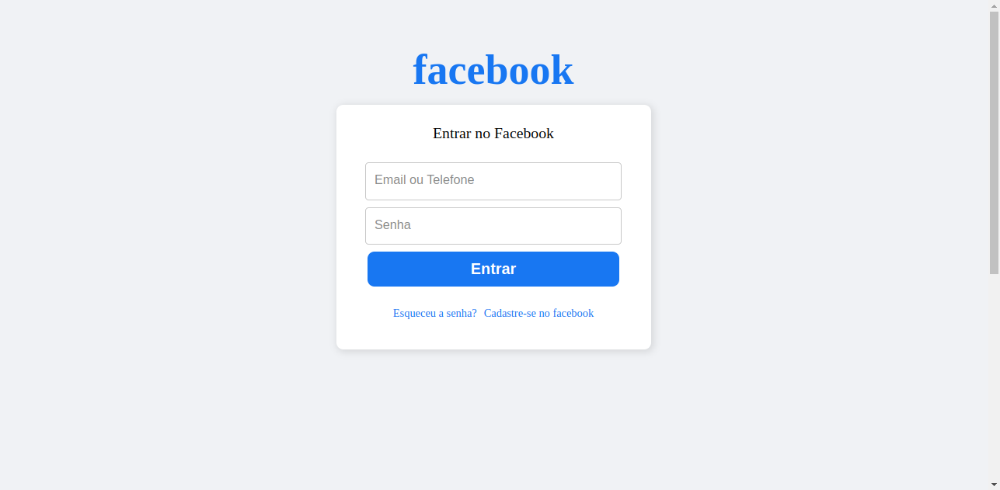
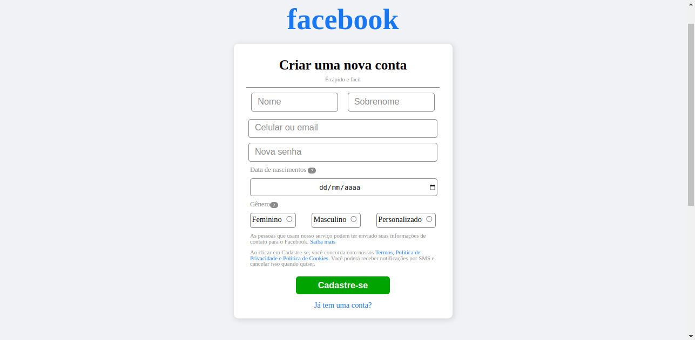
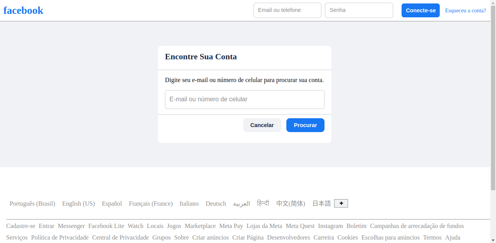

### Clone Facebook | FRONT-END | HTML5 e CSS3.

--->Tela de Login

--->Tela de Cadastro

--->Tela de esqueceu a senha

### Objetivo.

Praticar HTML5 e CSS3

Relembrar alguns codigos

Praticar responsividade

### Imagens do Projeto!

Tela de Login

Tela de Cadastro

Tela de Recuperar senha

### Link da Vercel:

https://clone-facebook-ruby.vercel.app/

OBS: O navegador vai identificar como site fraudulento, pois é uma proteção do navegador. Para Acessar o link da vercel desative a proteção do navegador!

